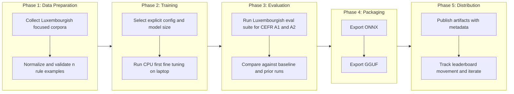

# Envisioning: Luxembourgish LLM Factory

> **Status:** Approved
> **Last updated:** 2026-07-18
> **Version:** 1.0

## 1. Client Context

### 1.1 Direct Client

The team or organization we are serving directly.

| Aspect | Information |
|--------|-------------|
| **Company/Team** | Independent builder and maintainer of this repository |
| **Domain** | Applied AI, language technology, education support |
| **Team scale** | Small: fewer than 10 developers |
| **Channels** | Local training workflows, CLI pipelines, model artifacts for inference runtimes |

### 1.2 End Client

The user or consumer served by the direct client.

| Aspect | Information |
|--------|-------------|
| **Profile** | Luxembourgish learners and developers using local inference stacks and community runtimes |
| **Volume** | Initial niche audience, expected to grow with open artifact distribution |
| **Usage context** | Local and community deployment through ONNX and GGUF compatible runtimes |

### 1.3 Additional Context

Luxembourgish is underrepresented in mainstream LLMs. Existing models often fail on Luxembourgish morphology, syntax, grammar, and language specific named entities. The project starts with Gemma 2B and 4B fine tuning and evolves to larger and MoE variants.

## 2. Project Focus

### Prioritized Problem

Build a reproducible engineering pipeline that can train, evaluate, and package Luxembourgish focused models with measurable progress on the LIST leaderboard.

| Aspect | Decision |
|--------|----------|
| **Chosen focus** | Reproducible Luxembourgish LLM factory with deterministic data to export flow |
| **Justification** | Current leaderboard leaders are not realistic for local hosting, and there is no reliable open pipeline specialized for Luxembourgish |
| **Initial scope** | Data preparation, CPU first training on n rule corpus slices, Luxembourgish evaluation, ONNX export, GGUF export, reproducible configs |
| **Out of initial scope** | Large scale multi node training, non Luxembourgish product features, generic multilingual optimization not tied to Luxembourgish outcomes |

## 3. Target Users

### 3.1 Luxembourgish Learners Using Local Models

Users who need practical language support at CEFR A1 and A2 levels using tools they can run locally.

**Key needs:**
- Better handling of Luxembourgish morphology and grammar in beginner level tasks
- Reliable responses for Luxembourgish specific named entities
- Models small enough for practical local usage

### 3.2 Developers and Community Runtime Users

Developers who need portable artifacts for local and community tooling.

**Key needs:**
- ONNX artifacts for personal inference stacks
- GGUF artifacts for Ollama, llama.cpp, and LM Studio
- Deterministic and explicit pipeline behavior for reproducibility

## 4. Diagnosis: Known Pain Points

### 4.1 Business Pain Points

| Problem | Impact | Source |
|---------|--------|--------|
| Luxembourgish quality is weak in mainstream models | Poor learning support and poor trust in outputs | Observed model behavior, project owner input |
| No reproducible Luxembourgish training factory | Slow iteration and difficult comparison across runs | Repository gap analysis |
| Leading leaderboard models are impractical for local hosting | Community adoption is limited without deployable model sizes | LIST AI Sandbox leaderboard context |

**Main impact area:**
- [ ] End user experience
- [ ] Internal operations
- [ ] Costs/efficiency
- [ ] Growth/scalability
- [x] Multiple areas

### 4.2 Technical Pain Points

Categories: Fragmentation, Scalability, Security, Observability, Agility, Integration, Performance, Maintainability

| Category | Problem | Impact |
|----------|---------|--------|
| Maintainability | Training and export steps are not yet encoded as deterministic, explicit configs | Reproducibility is weak and onboarding cost is high |
| Agility | Lack of a standard end to end flow from data prep to packaged artifacts | Slower experiment cycles and hard to compare model revisions |
| Integration | ONNX and GGUF exports are both required but not yet unified in one pipeline | Deployment friction across personal and community runtimes |

## 5. User Journey

Main journey from data preparation to publishable artifacts.

## 6. Strategic Goals

### 6.1 Business Goal

Reach a practical top tier Luxembourgish model quality for locally hostable sizes, focused on CEFR A1 and A2 learning use cases.

### 6.2 Technical Goal

Establish a deterministic, reproducible factory from data preparation through training, evaluation, and dual export, with minimal hidden defaults and explicit configuration at each stage.

### 6.3 Success KPIs

| KPI | Baseline | Target |
|-----|----------|--------|
| LIST leaderboard score for locally hostable baseline track | Gemma 4 E4B reference score: 62.50 | Exceed 70.00 in first major iteration |
| Gap to practical upper local reference | Gemma 4 26B reference score: 82.69 | Reduce gap by at least 25 percent from first tracked run |
| Reproducible pipeline executions | Not established | 100 percent of official runs reproducible from pinned config and documented commands |
| Export completeness per release | Not established | Every release produces ONNX and GGUF artifacts with matching model metadata |

Reference context used for calibration: LIST AI Sandbox reports DeepSeek R1 671B at 92.31, Gemma 4 31B at 90.38, Gemma 4 26B at 82.69, and Gemma 4 E4B at 62.50.

## 7. Constraints and Considerations

| Constraint Type | Constraint | Impact on Decisions |
|-----------------|-----------|---------------------|
| Infrastructure | Initial training runs on a standard laptop with CPU only | Early experiments prioritize small focused datasets and efficient configurations |
| Reproducibility | Full reproducibility is mandatory from data prep to export | All stages require explicit config, versioned parameters, and deterministic defaults |
| Model evolution | Multiple model sizes now, MoE variants later | Pipeline must support modular training profiles and future expansion |
| Evaluation | Luxembourgish specific evaluation is required | Generic benchmarks alone are insufficient for acceptance |
| Distribution | ONNX and GGUF artifacts are both required | Export pipeline must be first class, tested, and documented |

## 8. Scope Strategy

Identified scenario: architecture first.

The project has a clear strategic vision and clear constraints, and technical architecture choices around reproducibility, pipeline orchestration, and artifact export shape all downstream feature work.

## 9. Version Notes

| Version | Date | Notes |
|---------|------|-------|
| 1.0 | 2026-07-18 | Initial envisioning created from direct mode input and confirmed baseline context |
